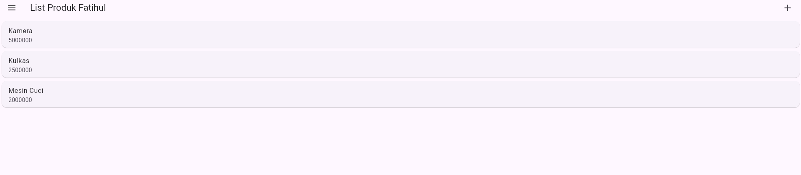
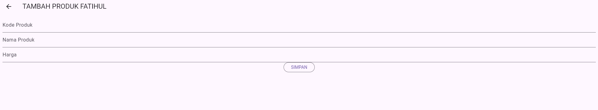
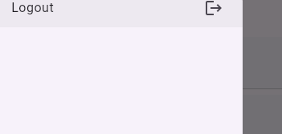

# Aplikasi Toko Kita (Mobile Programming - Pertemuan 10)

Proyek ini di praktikum intinya adalah implementasi modul Mobile Programming (Pertemuan 10) menggunakan Flutter. Aplikasi ini berfokus pada perancangan Antarmuka Pengguna (UI) untuk sistem manajemen Toko, mencakup fitur Registrasi, Login, dan CRUD Produk (Create, Read, Update, Delete) secara visual.

**Identitas Pembuat:**
* **Nama:** Fatihul Ihsan AL Ghoni
* **NIM:** H1D023016
* **Kelas:** D/B

---

## 📸 Screenshot Aplikasi

Berikut adalah tampilan antarmuka aplikasi yang telah dibuat dengan kustomisasi pada Action Bar.

| Halaman | Screenshot |
| :--- | :--- |
| **List Produk** Halaman utama menampilkan daftar produk dummy. |  |
| **Tambah Produk** Form untuk menambahkan data produk baru. |  |
| **Detail Produk** Menampilkan rincian produk dan opsi Edit/Hapus. |  |
| **Drawer & Logout** Menu samping untuk navigasi keluar. |  |

---

## 📂 Penjelasan Struktur Kode

Aplikasi memisahkan logika data (`model`) dan tampilan (`ui`) untuk menjaga kerapian kode.

### 1. Main Entry Point (`main.dart`)
File ini adalah gerbang utama aplikasi.
* Mengatur tema aplikasi (`ThemeData`).
* Menentukan halaman awal yang dibuka. Saat ini diset ke `ProdukPage()` agar langsung menampilkan daftar produk untuk keperluan testing UI.

### 2. Folder `lib/model` (Manajemen Data)
Berisi kelas-kelas representasi data (Blueprint) untuk menangani format JSON.
* **`registrasi.dart`**: Model untuk menampung respon saat user melakukan registrasi (menyimpan status dan data respon).
* **`login.dart`**: Model untuk menampung respon login, termasuk token akses, ID user, dan email.
* **`produk.dart`**: Model utama untuk objek Produk. Menyimpan atribut `id`, `kodeProduk`, `namaProduk`, dan `hargaProduk`. Dilengkapi fungsi `fromJson` untuk konversi data nanti.

### 3. Folder `lib/ui` (Antarmuka Pengguna)
Berisi halaman-halaman visual yang berinteraksi dengan pengguna.

#### A. `registrasi_page.dart`
Halaman untuk pendaftaran pengguna baru.
* **Fitur:** Form validasi untuk Nama (min 3 karakter), Email (validasi format email), dan Password (min 6 karakter & konfirmasi harus sama).
* **Custom:** Judul AppBar diubah menjadi **"Registrasi Fatihul"**.

#### B. `login_page.dart`
Halaman untuk masuk ke dalam aplikasi.
* **Fitur:** Input Email dan Password dengan validasi. Terdapat link di bagian bawah untuk menuju halaman Registrasi jika belum punya akun.
* **Custom:** Judul AppBar diubah menjadi **"Login Fatihul"**.

#### C. `produk_page.dart` (Halaman List Produk)
Halaman utama yang menampilkan daftar semua produk.
* **Fitur:**
    * Menggunakan `ListView` untuk menampilkan daftar produk secara <i>scrollable</i>.
    * Menggunakan widget `Card` dan `ListTile` untuk tampilan item produk yang rapi.
    * Terdapat `Drawer` (menu samping) yang berisi tombol Logout.
    * Tombol tambah (`+`) di pojok kanan atas untuk navigasi ke halaman Form Produk.
* **Custom:** Judul AppBar diubah menjadi **"List Produk Fatihul"**.

#### D. `produk_detail.dart`
Halaman yang muncul saat salah satu item produk diklik.
* **Fitur:** Menampilkan detail lengkap (Kode, Nama, Harga) dari produk yang dipilih.
* **Tombol Aksi:**
    * **Edit:** Mengarahkan ke `ProdukForm` dengan membawa data produk untuk diedit.
    * **Delete:** Memunculkan *Dialog Konfirmasi* ("Yakin ingin menghapus data ini?").
* **Custom:** Judul AppBar diubah menjadi **"Detail Produk Fatihul"**.

#### E. `produk_form.dart` (Tambah & Ubah)
Halaman formulir yang bersifat dinamis (Reusable).
* **Logika:** Halaman ini mendeteksi apakah data `produk` dikirim atau tidak.
    * Jika **Null**: Mode menjadi **"TAMBAH PRODUK"**.
    * Jika **Ada Data**: Mode berubah menjadi **"UBAH PRODUK"** dan kolom isian otomatis terisi data lama.
* **Custom:** Judul AppBar menyesuaikan menjadi **"TAMBAH PRODUK FATIHUL"** atau **"UBAH PRODUK FATIHUL"**.

---

## INTINYA AP? YES AKU KEREN MWAHAHAHHAHAHAHAHHAHAHA

## PERTEMUAN 11 TUGAS 9

 Aplikasi kini terhubung langsung dengan Backend API (CodeIgniter 4) untuk mengelola data secara *real-time*.

### 🛠️ Perubahan & Penambahan Fitur

#### 1. Manajemen Koneksi & Data (`lib/helpers`)
Folder ini dibuat untuk menangani komunikasi teknis dengan server.
* **`api.dart`**: Wrapper untuk *HTTP Request* (POST, GET, PUT, DELETE) yang menangani header token dan *error handling* (koneksi putus, server error, dll).
* **`api_url.dart`**: Pusat konfigurasi *Endpoint*. URL disesuaikan dengan IP Laptop (`192.168.x.x`) agar bisa diakses via HP Fisik/Emulator.
* **`user_info.dart`**: Menggunakan `shared_preferences` untuk menyimpan **Token** dan **User ID** agar user tetap login meskipun aplikasi ditutup.

#### 2. Business Logic Component (`lib/bloc`)
Pemisahan logika bisnis dari tampilan (UI) agar kode lebih bersih dan terstruktur.
* **`registrasi_bloc.dart`**: Mengirim data pendaftaran ke API.
* **`login_bloc.dart`**: Memverifikasi kredensial login dan menerima Token.
* **`produk_bloc.dart`**: Jembatan untuk operasi CRUD (Create, Read, Update, Delete) data produk antara UI dan Server.
* **`logout_bloc.dart`**: Menangani proses hapus sesi login.

#### 3. Integrasi UI (`lib/ui`)
Memodifikasi file UI yang dibuat di Pertemuan 10 agar bisa berinteraksi dengan BLoC.
* **Login & Registrasi**: Tombol kini memanggil API, menampilkan *Dialog Sukses/Gagal*, dan mengarahkan user sesuai statusnya.
* **Produk Page**: Menggunakan `FutureBuilder` untuk mengambil data list produk dari database secara asinkron.
* **Form Produk**: Logika tombol "Simpan" kini mendeteksi apakah sedang dalam mode *Tambah* atau *Edit*, lalu mengirim request yang sesuai ke API.

### ⚙️ Catatan Konfigurasi
Untuk menjalankan aplikasi ini dengan lancar:
1.  **Backend**: Pastikan server CodeIgniter 4 berjalan (`php spark serve --port 8080`).
2.  **Koneksi**: Pastikan `api_url.dart` menggunakan IP Address yang sesuai dengan jaringan lokal (jika menggunakan HP Fisik).
3.  **Database**: Pastikan MySQL di Laragon aktif.

---
**Status Proyek:** ✅ Selesai (Full Stack Mobile App dengan Flutter & CodeIgniter 4) namun masih eror dah nyerah saya
